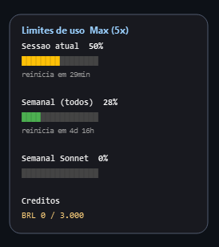

# Widget de Uso do Claude

Widget de desktop para Windows que mostra os **limites de uso do plano**
do Claude (os mesmos números da tela Configurações > Uso e do comando
`/usage`): sessão atual (janela de 5h), limites semanais e créditos de uso.
Fica sempre no topo, visível em todos os desktops virtuais, fora da taskbar,
com ícone no system tray.

App nativo em Python + PySide6, compilado em um executável único com PyInstaller.
Sem Docker, sem serviço externo, sem dependências web.

## Exemplo



O widget exibe a sessão atual (janela de 5h), os limites semanais e os
créditos de uso, com barras de progresso e o tempo para reiniciar.

## Recursos

- Janela pequena, sem borda, cantos arredondados, caixa escura sólida com borda.
- Sempre no topo, em qualquer desktop virtual, fora da taskbar.
- Mostra os limites do plano com barras de progresso coloridas:
  - **Sessão atual** (janela de 5h): % usado e quando reinicia.
  - **Semanal (todos os modelos)**: % usado e quando reinicia.
  - **Semanal (somente Sonnet)**: % usado.
  - **Créditos de uso**: gasto x limite (quando habilitado).
- Atualiza o tempo restante a cada 2 segundos e busca os dados na rede a
  cada 5 minutos (em uma thread, para não travar a interface). O endpoint
  de uso é limitado no servidor, então o intervalo é propositalmente baixo
  e há backoff automático se vier um 429 (rate limit).
- Roda em instância única: abrir o programa de novo não cria um segundo
  widget (evita consultas duplicadas e 429).
- Arrastável com o mouse. A posição persiste entre execuções.
- Ícone no system tray com menu: Mostrar/Ocultar, Atualizar agora,
  alternar Fonte, Resetar (modo tokens), Sair.
- Tratamento de erro: se não houver login ou conexão, mostra "sem dados"
  com o motivo, em vez de quebrar.

## Instalação em outra máquina Windows (usuário final)

O programa é um executável único. Você não precisa instalar Python nem nada
para usar: basta o arquivo `TokenWidget.exe`.

### Requisitos

- Windows 10 ou 11, 64 bits (x64). Não é testado em Windows ARM.
- Para o modo padrão (limites do plano): ter o **Claude Code instalado e
  logado** nessa máquina, com uma conta Claude (assinatura). O widget
  reaproveita esse login (lê `%USERPROFILE%\.claude\.credentials.json`).
  O limite é da sua conta, então os números são os mesmos em qualquer PC
  onde você esteja logado.
- Acesso à internet (a `api.anthropic.com`).

Sem o login do Claude Code, o widget abre normalmente, mas o modo limites
mostra "sem dados (sem login do Claude Code)". As fontes em tokens também
dependem do Claude Code naquele PC; só a fonte "arquivo manual" funciona
sem ele.

### Passos

1. Baixe o `TokenWidget.exe` (veja a seção Releases do projeto no GitHub,
   ou compile você mesmo conforme a seção "Como compilar o .exe").
2. Copie o `.exe` para qualquer pasta (ex.: `C:\Users\<voce>\Apps\`).
3. Dê dois cliques para abrir. O widget aparece no canto da tela e um ícone
   surge no system tray.
4. Opcional: coloque para iniciar com o Windows (veja "Como iniciar junto
   com o Windows" mais abaixo).

Não é preciso copiar a pasta `src`, o `.venv` nem mais nada: o `.exe` já
contém tudo. Os arquivos de config e estado são criados sozinhos no
`%USERPROFILE%` da máquina nova.

### Aviso do Windows na primeira execução

Como o `.exe` não tem assinatura digital, o Windows SmartScreen pode mostrar
"O Windows protegeu o seu computador". Clique em **Mais informações** e depois
em **Executar assim mesmo**. Alguns antivírus também podem alertar por se
tratar de um executável empacotado com PyInstaller; é um falso positivo
comum desse tipo de empacotamento.

## De onde vem o número

No modo padrão, o widget lê os limites direto do backend da Anthropic,
o mesmo endpoint que o Claude Code usa no `/usage`:

- Usa o token OAuth já salvo pelo Claude Code em
  `%USERPROFILE%\.claude\.credentials.json`.
- Chama `GET https://api.anthropic.com/api/oauth/usage`.
- Se o token estiver expirado, faz o refresh (igual ao Claude Code) e
  grava o token renovado de volta no arquivo de credenciais, para não
  deslogar você.

Tudo usa apenas as suas próprias credenciais locais, só para exibir o seu
próprio uso. Nada é enviado para terceiros. Para o modo limites funcionar,
você precisa estar logado no Claude Code com uma conta Claude (assinatura).

## Fontes de dados

O widget tem três fontes, alternáveis pelo menu do tray (item "Fonte: ...",
que cicla entre elas). A fonte fica salva na config (campo `fonte`).

1. **Limites do plano (`limites`, padrão)**: os limites de uso descritos
   acima. É o que aparece na imagem das Configurações.

2. **Tokens da sessão Claude (`claude`)**: lê os transcripts que o Claude
   Code grava em `%USERPROFILE%\.claude\projects\...\*.jsonl`, soma o consumo
   de todas as mensagens do assistente da sessão ativa e mostra total de
   tokens e custo estimado em USD e BRL.

3. **Arquivo manual (`arquivo`)**: lê de `%USERPROFILE%\.claude_tokens.json`,
   alimentado pela função `token_logger.registrar()` a partir do seu próprio
   script que chama a API.

> Observação sobre "Resetar": só se aplica aos modos em tokens. No modo
> `claude` grava um ponto de partida (baseline) e o widget passa a mostrar o
> consumo a partir desse momento, na mesma sessão. No modo `arquivo` zera o
> arquivo. No modo `limites` não se aplica (o uso do plano é controlado pela
> Anthropic e reinicia sozinho nas janelas de 5h e semanal).

## Estrutura

```
claude_token_win_tray/
  .venv/                 ambiente virtual (não versionado)
  src/
    main.py              app, widget e tray
    usage_api.py         lê os limites do plano (token OAuth + /api/oauth/usage)
    claude_session.py    lê o consumo em tokens da sessão do Claude Code
    token_logger.py      função registrar() para uso externo (fonte manual)
    pricing.py           tabela de preços por modelo + cálculo
    config.py            leitura/escrita de config (posição, usd_brl, fonte)
  requirements.txt
  build.bat              compila com PyInstaller
  README.md
  .gitignore
```

## Arquivos de dados (no perfil do usuário)

- `%USERPROFILE%\.claude_tokens.json` : estado da sessão (contagens de tokens).
- `%USERPROFILE%\.claude_token_widget.json` : config do widget (posição, cotação).

Formato do estado:

```json
{
  "input_tokens": 0,
  "output_tokens": 0,
  "cache_creation_tokens": 0,
  "cache_read_tokens": 0,
  "model": "claude-opus-4",
  "session_started": "2026-06-01T13:30:00-03:00"
}
```

## Como rodar em modo dev

1. Criar e ativar o venv:

   ```bat
   python -m venv .venv
   .venv\Scripts\activate
   ```

2. Instalar dependências:

   ```bat
   pip install -r requirements.txt
   ```

3. Rodar:

   ```bat
   python src\main.py
   ```

Para testar valores, edite manualmente `%USERPROFILE%\.claude_tokens.json`.
O widget reflete as mudanças em até 2 segundos.

## Como compilar o .exe

Com o venv criado e as dependências instaladas, rode:

```bat
build.bat
```

Isso gera `dist\TokenWidget.exe` (executável único, sem janela de terminal).
O `build.bat` usa o PyInstaller com as flags:

- `--onefile` : um único arquivo .exe
- `--windowed` : sem janela de console preta
- `--name TokenWidget` : nome do executável
- `--paths src` : para achar os módulos locais

O ícone é gerado por código (um medidor com três barras), não precisa de
arquivo .ico.

## Como publicar no GitHub (para quem mantém o projeto)

O `.gitignore` já exclui `dist/`, `build/`, `.venv/` e os arquivos locais de
config e credenciais. Isso é proposital: artefatos de build e dados pessoais
não devem ir para o repositório.

Para distribuir o executável para outras pessoas:

1. Compile com `build.bat` (gera `dist\TokenWidget.exe`).
2. No GitHub, crie um **Release** e anexe o `TokenWidget.exe` como binário do
   release (em vez de commitar dentro do repositório).
3. No README, aponte os usuários para a página de Releases para baixar o
   `.exe` pronto.

Assim o código-fonte fica versionado e o binário fica disponível para
download sem inchar o histórico do git.

## Como iniciar junto com o Windows

1. Pressione `Win + R`, digite `shell:startup` e tecle Enter.
   Isso abre a pasta de inicialização do usuário.
2. Crie um atalho para `dist\TokenWidget.exe` dentro dessa pasta
   (clique direito no .exe, Enviar para, Área de trabalho, e depois
   mova o atalho para a pasta de inicialização, ou cole o atalho direto lá).
3. No próximo login, o widget abre sozinho.

Para remover da inicialização, apague o atalho dessa pasta.

## Como integrar com o seu script que chama a API

O módulo `token_logger.py` expõe a função `registrar(usage, model)`, que
acumula os tokens de forma incremental no arquivo de estado. Importe-o
no seu script:

```python
import sys
sys.path.insert(0, r"C:\Projetos\claude_token_win_tray\src")

from token_logger import registrar

# ... voce chama a API e recebe uma resposta ...
resposta = client.messages.create(...)

# Acumula o consumo desta chamada na sessao atual.
# Aceita o objeto usage do SDK ou um dicionario com os mesmos campos.
registrar(resposta.usage, model="claude-opus-4")
```

Campos esperados em `usage` (faltantes contam como zero):

- `input_tokens`
- `output_tokens`
- `cache_creation_input_tokens`
- `cache_read_input_tokens`

Também dá para passar um dicionário direto:

```python
registrar({
    "input_tokens": 1200,
    "output_tokens": 350,
    "cache_creation_input_tokens": 0,
    "cache_read_input_tokens": 800,
}, model="claude-opus-4")
```

Para zerar a sessão por código, use `token_logger.resetar_sessao()`
(o mesmo que a opção Resetar no menu do tray).

## Preços e cotação

A tabela de preços por modelo fica em `src\pricing.py`, em USD por milhão de
tokens, separada em input, output, cache write e cache read. Ajuste conforme a
tabela oficial vigente.

A cotação USD para BRL é fixa, lida do campo `usd_brl` da config
(default 5.40). Não é buscada online. Para mudar, edite
`%USERPROFILE%\.claude_token_widget.json` ou ajuste o default em
`src\config.py`.

## Menu do tray

- **Mostrar/Ocultar** : alterna a visibilidade do widget (clicar no ícone
  do tray também alterna).
- **Atualizar agora** : força uma releitura imediata (no modo limites,
  consulta a rede na hora).
- **Fonte: ...** : cicla entre as fontes (limites do plano, tokens da sessão
  Claude, arquivo manual).
- **Resetar (modo tokens)** : reseta as fontes em tokens (baseline no modo
  `claude`, zera o arquivo no modo `arquivo`). Não se aplica ao modo limites.
- **Sair** : encerra o app.

## Aviso e privacidade

- Este projeto não é oficial e não tem vínculo com a Anthropic. Os nomes
  Claude e Anthropic pertencem aos seus donos.
- O modo limites usa um endpoint interno do Claude Code
  (`/api/oauth/usage`), que não é uma API pública documentada. Ele pode
  mudar ou parar de funcionar em versões futuras do Claude Code. Se isso
  acontecer, basta atualizar as constantes em `src\usage_api.py` (os outros
  modos continuam funcionando).
- O widget lê as credenciais locais do Claude Code apenas na sua própria
  máquina, para exibir o seu próprio uso. Nada é enviado para terceiros: a
  única comunicação de rede é direto com os servidores da Anthropic
  (`api.anthropic.com` e `platform.claude.com`), exatamente como o Claude
  Code já faz.
- Quando o token OAuth expira, o widget faz o refresh e grava o token
  renovado de volta em `%USERPROFILE%\.claude\.credentials.json`, igual ao
  próprio Claude Code, para não deslogar você. Esse arquivo nunca é copiado
  nem versionado.
- Use por sua conta e risco. Recomenda-se adicionar uma licença de código
  aberto (por exemplo MIT) antes de publicar, criando um arquivo `LICENSE`
  na raiz do projeto.
